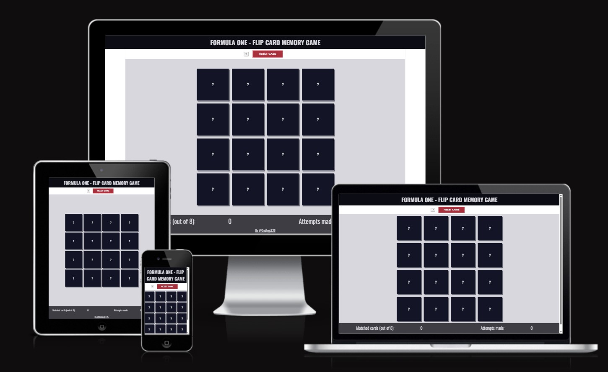
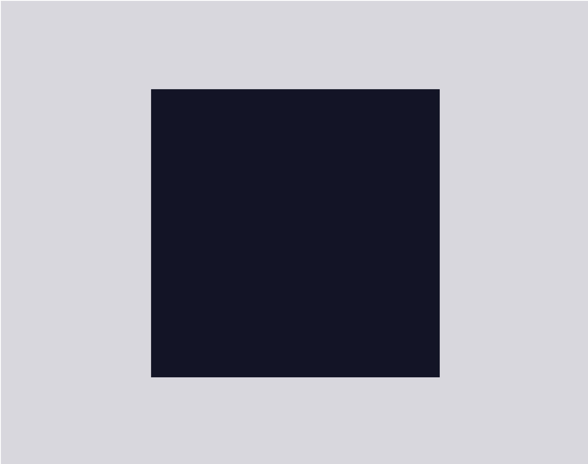
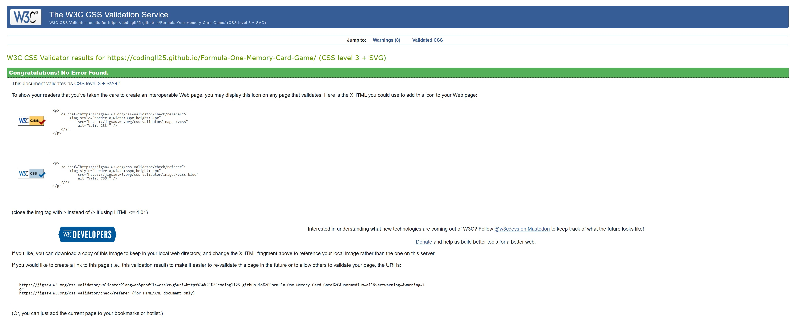

# Formula-One-Memory-Card-Game

# Formula-One-Memory-Card-Game
Formula One - Memory Card Game is a game site, which allows fans or those interested in testing their knowledge using cards, which flip upon being click. The site is targeted to those wanting to play a simple game relating to F1, with the aim of being fun and interesting. 

The site can be accessed here: https://codingll25.github.io/Formula-One-Memory-Card-Game/

## User Stories
  - External user's goal: The site's users are interested in testing their F1 knowledge.

  - Site owner's goal: The goal of the site is provide a game for users to interact with and have fun.

## Features 

- __Heading__
  - Outlines the title of the game, to allow users to assess if the site is suitable for them or not

  - __Control Area__
    - Control area includes a "Let's get started" button, which shows the cards to be matched once seleted. The DOM is updated based on an event listener added to the start button.
    - An information button has been included, which pops up with details of how to play the game once selected. This ensures the user is familiar with the rules of the game.
    - Once the start button has been selected, a "reset board" button appears, which reshuffles the cards and resets the matched card score and attempts made.

  Before the game has started:
  

  Once the game has started:
  

  - __Cards Area__
     - This section shows the cards, in a 4 x 4 grid. Each card is associated with a F1 image taken from Unsplash.
     - Hover effect added to cards to improve site usability, and to allow the user to see which card the mouse is hovering over.
     - Flip effect has been added to the cards using "rotate" in CSS. 
  
  Before the game has started:
  

  Once the game has started:
  
  

  - __Footer__
    - The footer section includes the matched scores count and the attempts made, which increment each time the user matches a card, and select two cards for matching.
    - This feature allows the user to understand how close they are to winning the game, and how many attempts it has taken.

  Footer:
  

  Incremented score and attempts made for matched cards:
  

  Incremented attempts made for unsuccessful match:
  

## Technologies used
- [HTML](https://developer.mozilla.org/en-US/docs/Web/HTML) was used to develop the foundation of the site.
- [CSS](https://developer.mozilla.org/en-US/docs/Web/css) - was used to add the styles and layout of the site.
- [CSS roots](https://developer.mozilla.org/en-US/docs/Web/CSS/:root) was used to declare global CSS variables and apply them throughout the project. 
- [VSCode](https://code.visualstudio.com/) was used as the main tool to write and edit code.
- [JavaScript](https://developer.mozilla.org/en-US/docs/Web/JavaScript)
- [Git](https://git-scm.com/) was used for the version control of the website.
- [GitHub](https://github.com/) was used to host the code of the website.
- [favicon.io](https://favicon.io/emoji-favicons) was used to generate the site favicon.
- [Font Awesome](https://fontawesome.com/) was used to generate the fonts for the site.
- [amiresponsive](https://codingll25.github.io/Formula-One-Memory-Card-Game/) was used to generate the responsive mockup
- [responsive viewer](https://chromewebstore.google.com/detail/responsive-viewer/inmopeiepgfljkpkidclfgbgbmfcennb) was used to generate images for the site across multiple screen sizes (show site responsiveness)
- [unsplash](https://unsplash.com/s/photos/formula-one) for stock images.

## Design

### Color Scheme
- Dark blue/black (primary color)was used as a background color for the heading only to provide contrast, and to bring the users attention to the heading.

- Lighter blue/black (secondary color) was used for the flip cards to show some contrast between the heading and the background.

- Grey (highlight) was used to provide a contrast with the existing colors, to provide clarity and help break up the white space. Shows the game space. 

- Taupe (light-highlight) was used to highlight when the user was hovering over specific links or inputs.

- Red / pink (bright-highlight) was used to highlight the reset board function.

### Typography
- Oswald Font was used as the main font of the website in order to increase readability of the content within the site. 

## Testing
### Responsiveness
- The site was checked by devtools, as well as [responsive viewer](https://codingll25.github.io/Formula-One-Memory-Card-Game/)

### Manual testing
| feature | action | expected result | tested | passed | comments |
| --- | --- | --- | --- | --- | --- |
| Start button | Click on the "Start" button| The cards for matching should appear | Yes | Yes | - |
| Start button | Click on the "Start" button| The start button should disapear | Yes | Yes | - |
| Reset game button| Click on the "Start" button | The button should appear when the start button has been selected | Yes | Yes | - |
| Reset game button| Click on the "Reset game" button | The cards should reshuffle and an alert should appear | Yes | Yes | - |
| Reset game button| Click on the "Reset game" button | Matched cards score should reset to 0 | Yes | Yes | - |
| Reset game button| Click on the "Reset game" button | Attempts made should reset to 0 | Yes | Yes | - |
| Flip cards| Click on a card | The card should flip when clicked to reveal the image, only two cards to be selected at once | Yes | Yes | - |
| Flip cards| Hover over card| The card should be highlighted in a contrasting color to show the individual which card they are wanting to select | Yes | Yes | - |
| Matched cards| Click on two cards which match | The matching cards should be "disabled" | Yes | Yes | - |
| Matched cards score| Click on two cards which match| The score should increment by one | Yes | Yes | - |
| Unmatched cards| Click on two cards which do not match | The matching cards should be re-flipped to hide the image | Yes | Yes | - |
| Attempts made| Click on two cards | The attempts made should increment by one| Yes | Yes | - |

### Validator Testing 
- HTML: no errors were returned when passing through the official [W3C validator]

- CSS: no errors noted when passing CSS code through the official [(Jigsaw) validator]. Warnings related to "reset-board" flagged, left unchanged as I opted to hide the button by making eveything white.

- Javascript: one warning noted when passing through the official [(jshint) validator]. No amends made here as site was functional.

### Lighthouse Report
  - Using lighthouse in devtools, the webpage the Performance, Best Practices and SEO were all high with scores of 99 and 100 respectively. The Accessibility score was not as high with a value of 94.

### Fixed bugs
- Matched cards could be selected again, resulting in one card constantly flipped meaning site user cannot continue to select a card. script.js updated to prevent "clicked" being added to cards which contained "matched".

## Deployment
- The site was deployed to GitHub pages. The steps to deploy are as follows: 
  - In the GitHub repository, navigate to the Settings tab 
  - From the pages section, select the Main Branch
  - Once the main branch has been selected, the page will be automatically refreshed with a detailed ribbon display to indicate the successful deployment. 

The live link can be found here (https://codingll25.github.io/Formula-One-Memory-Card-Game/)

## Future improvements
  - Randomise cards better (some instances where the same card ends up next to eachother)
  - Improve frequency of commit messages for each change made, rather than grouping changes together, particularly towards the end of the project when fixing bugs
  - Additional testing for the project, based on different browsers
  - Increase complexity by changing the images or increasing the size of the grid (i.e. 6 x 6)
  - Improve accessibility and site by updating alerts to something more personalised and formatted
  - Improve accessibility and site by including valiation for the restart (i.e. are you sure you'd like to restart - yes or no)

## Credits 
- Site favicon taken from [favicon.io](https://favicon.io/emoji-favicons)
- README file formatting, ordering, and manual testing section taken from [Iuliia Konovalova's](https://github.com/IuliiaKonovalova) ["Animal Shelter" respository](https://github.com/IuliiaKonovalova/animal_shelter/tree/main). 
- Media images taken from UnSplash:
    - [image1](assets/images/image1.jpg) by [Dulant Pang](https://unsplash.com/@dpxng) on Unsplash 
    - [image2](assets/images/image2.jpg) by [Matt Seymour](https://unsplash.com/@mattseymour)on Unsplash
    - [image3](assets/images/image3.jpg) by [James Watson](https://unsplash.com/@just_anotha_photographer)  on Unsplash
    - [image4](assets/images/image4.jpg) by [Philip Myrtorp](https://unsplash.com/@philipmyr) on Unsplash
    - [image5](assets/images/image5.jpg) by [Maxime Vandenberge](https://unsplash.com/@mxvandeberge)on Unsplash
    - [image6](assets/images/image6.jpg) by [rishi](https://unsplash.com/@beingabstrac) on Unsplash
    - [image7](assets/images/image7.jpg) by [Taehoon Kim](https://unsplash.com/@duometre_) on Unsplash
    - [image8](assets/images/image8.jpg) by [Abhinand Venugopal](https://unsplash.com/@i_abhinand) on Unsplash
- [Coding made simple](https://www.youtube.com/watch?v=t3cydTwfEnM) for inspiration on creating the flip card game with step-by-step tutorial
    

## Acknowledgements
  - [Iuliia Konovalova](https://github.com/IuliiaKonovalova) for being a wonderful mentor throughout this process.
  - [Coding made simplified](https://www.youtube.com/watch?v=t3cydTwfEnM) for the step-by-step tutorial. Reference the youtube tutorial only, however the full code by younusraza909 can be found on [githubb] (https://github.com/younusraza909/memory-game-js)